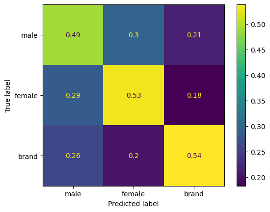

# Gender Classification Model

## Project Description

The dataset used for this project consisted of 20,000 tweets on Twitter and information about the associated users' account profiles. Each user was labeled male, female, or brand (non-individual). More information about the dataset can be found on [Kaggle](https://www.kaggle.com/datasets/crowdflower/twitter-user-gender-classification).

I only considered two features for classification: the user's profile description, and the text of the user's tweet. I isolated the description and text columns from the data, then used [spaCy](https://spacy.io/) for tokenization and lemmatization on both columns. The [scikit-learn](https://scikit-learn.org/stable/#) library was used to extract unigrams and bigrams in tf-idf format, as well as remove stopwords.

The model I used was the scikit-learn Gaussian Naive Bayes classifier, which was trained with a 5-fold cross validation. Data was split for 90% training and 10% testing data.

When run on the testing dataset, the model had an accuracy of 48%. Displayed below is the confusion matrix showing the results of running the model on the testing data.

